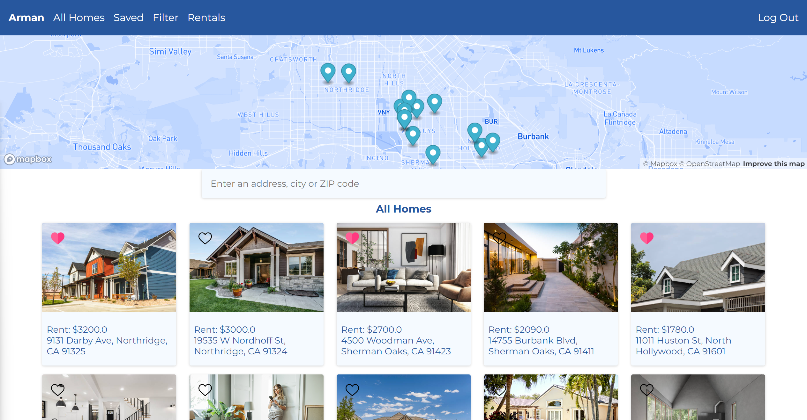

# Home Rentals

## Description
This is a home rental website where the user can list a new home, rent, save, or send a tour request to the listing owner. Filter listings using different options.

## Technologies Used
- HTML
- CSS
- JavaScript (ES6)
- Django 
- SQLite 

## Usage
Login to the user's account using the login form. Register an account using the register form. Go to my account using the 'My Account' button for browsing the website. Use the navbar buttons to navigate between the pages. Toggle between the listings using the map and by clicking on the listing. Use the 'Rentals' button on the navbar to list a new rental, see the user's listings, and tour requests. Use the 'Filter' button on the navbar to filter homes based on the home type, bed qty, bath qty, price and year built. On the specific listing page send a tour request using the 'Request a Tour' form.

### Go to [Home Rentals](https://home-rentals-7803.onrender.com/)

Login Register

Home page

Listing details page

Filter listings

Tour requests

List a rental

## Questions
### Use the links below if you have any questions.
- Email Address - [armanbarseghyan83@gmail.com](mailto:armanbarseghyan83@gmail.com)
- Linkedin - [https://www.linkedin.com/in/arman-barseghyan](https://www.linkedin.com/in/arman-barseghyan)
- GitHub Profile - [https://github.com/ArmanBarseghyan83](https://github.com/ArmanBarseghyan83)